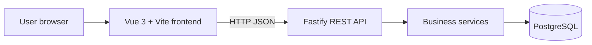
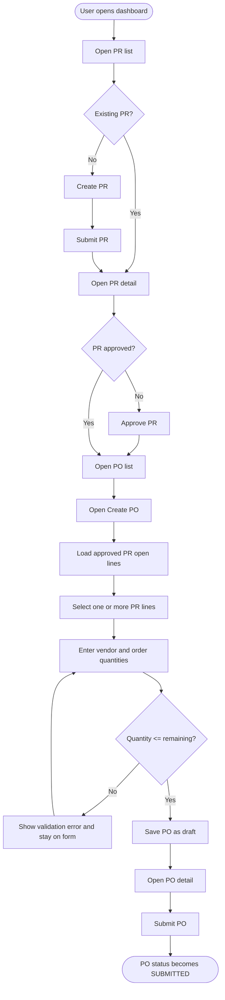
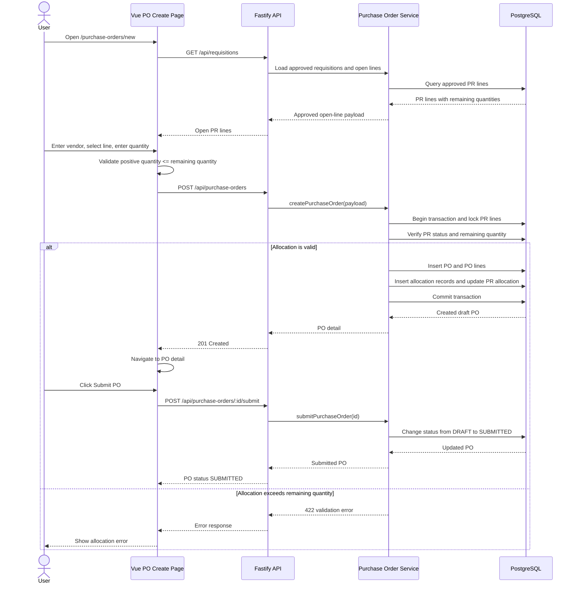

# Procurement MVP Application Guide

## Overview

Procurement MVP is a small web application for managing purchase requisitions (PR) and purchase orders (PO). It supports the request-to-order flow:

1. Create a purchase requisition.
2. Submit the requisition for review.
3. Approve the requisition.
4. Create a purchase order from approved PR lines.
5. Submit the purchase order.
6. Review the PO quantities and status.

The application is intended for workshop use. It does not include authentication, role-based access, notifications, reporting, or an approval workflow engine.

## Current Scope

### Available

- Dashboard with PR counts and recent requisitions.
- PR list, create, detail, submit, and approve operations.
- PO list, create, detail, and submit operations.
- PO allocation validation against the remaining quantity on an approved PR line.
- REST API documentation at `/api-docs`.
- Health check at `/health`.

### Not Available Yet

Goods Receipt (GR) is represented in the database plan but is not implemented in the current application UI or API. Receiving and posting goods therefore remain future work.

## Architecture

The browser runs the Vue application. Vue page components call the shared API helper, which sends REST requests to Fastify. Fastify routes delegate business rules to service functions, and the services read or update PostgreSQL.



## Navigation

The global navigation exposes these pages:

- `/`: Dashboard
- `/requisitions`: Purchase Requisition list
- `/requisitions/new`: Create Purchase Requisition
- `/requisitions/:id`: Purchase Requisition detail
- `/purchase-orders`: Purchase Order list
- `/purchase-orders/new`: Create Purchase Order
- `/purchase-orders/:id`: Purchase Order detail

From the PO list, choose **New PO** to start a PO. The PO create page loads open lines from approved requisitions only.

## User Flow

A PR must be approved before its lines can be allocated to a PO. The remaining quantity is calculated as requested quantity minus allocated quantity. A PO line may allocate any positive quantity up to that remaining amount.



## PO Create and Submit Sequence

The following sequence describes the current happy path. The create request performs the authoritative allocation check inside a database transaction before inserting the PO and updating the PR line allocation.



## API Responsibilities

### Requisitions

- `GET /api/requisitions`: list requisitions.
- `POST /api/requisitions`: create a draft requisition.
- `GET /api/requisitions/:id`: view requisition details.
- `POST /api/requisitions/:id/submit`: move a draft requisition to submitted.
- `POST /api/requisitions/:id/approve`: approve a submitted requisition.
- `GET /api/requisitions/:id/open-lines`: list PR lines available for PO allocation.

### Purchase Orders

- `GET /api/purchase-orders`: list purchase orders.
- `POST /api/purchase-orders`: create a draft PO from PR lines.
- `GET /api/purchase-orders/:id`: view PO details and line quantities.
- `POST /api/purchase-orders/:id/submit`: move a draft PO to submitted.
- `GET /api/purchase-orders/:id/open-lines`: list PO lines open for future receipt handling.

Successful PO creation updates `pr_lines.qty_allocated` and records the relationship in `pr_line_allocations`. PO submission only permits a PO in `DRAFT` status.

## Validation Behavior

The frontend checks:

- Vendor name is required.
- At least one PR line must be selected.
- Order quantity must be greater than zero.
- Order quantity must not exceed the line's remaining quantity.

The backend repeats the important checks and is the final authority. It also verifies that the source PR is `APPROVED`, the PR line exists, required line fields are present, and the PO status transition is valid.

## Running Locally

Start PostgreSQL and bootstrap the sample data:

```bash
docker compose down -v
docker compose up -d db
```

Install dependencies and start the backend:

```bash
cd backend
npm install
npm run dev
```

In a second terminal, install dependencies and start the frontend:

```bash
cd frontend
npm install
npm run dev
```

The frontend is available at `http://localhost:5173`. The backend is available at `http://localhost:3000`.

## Testing

Run unit tests from the repository root:

```bash
npm test
```

Run the focused PO end-to-end test:

```bash
npm run test:e2e -- tests/e2e/po-module.spec.js
```

Playwright writes the HTML report to `playwright-report/index.html` and screenshots, traces, videos, and JSON results under `test-results/`. These generated directories are ignored by Git.
